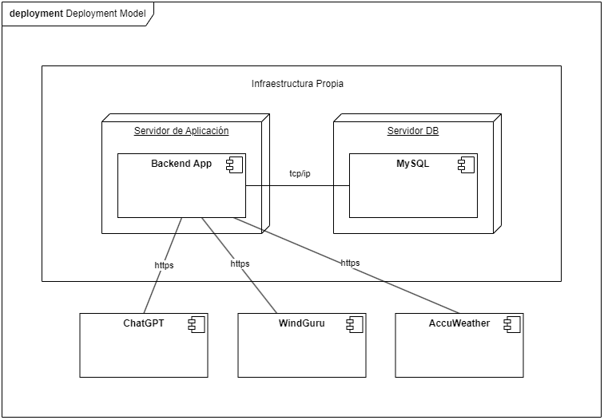

# Mototrack

UTN FRBA - Diseño de Sistemas - Primer Parcial 2024

## Contexto general

En esta oportunidad vamos a diseñar y desarrollar Mototrack, una aplicación móvil que tiene la finalidad de permitir a los motoqueros visualizar y recorrer caminos no convencionales de forma recreativa. La plataforma está pensada para la comunidad de motoqueros que busca nuevas aventuras y rutas alternativas, proporcionando una experiencia única y personalizada en sus viajes.

## Gestión de motos

El Sistema debe permitir que cada motoquero gestione sus motos. De cada moto nos interesa conocer, mínimamente, su marca, modelo, año, número de matrícula (patente), fotografía/s y capacidad del tanque de combustible.

## Gestión de caminos no convencionales

Los administradores de la plataforma deberán poder cargar caminos no convencionales. De cada camino nos interesa, mínimamente, tener la siguiente información: nombre del camino, descripción detallada, fotografías del camino (cada una con descripción), nivel de dificultad (principiante, intermedio, avanzado, extremo), tipo de terreno (asfalto, ripio, mixto, etc.), duración estimada del recorrido (puede ser en horas y/o en días), distancia total, punto de partida y punto de llegada.

## Categoría del motoquero

Cada motoquero tendrá una categoría las cuales pueden ser: principiante, intermedio, avanzado o extremo.

- Todo motoquero que no tenga ningún kilómetro realizado será considerado *principiante*.
- Para pasar a ser *intermedio* se necesitan al menos 2500km.
- Si el motoquero alcanza los 5000km pasa a ser considerado *avanzado*.
- Con más de 15.000km será *extremo*.

Al momento de registro, el motoquero deberá indicar sus kilómetros iniciales recorridos. Solamente se deberán considerar los kms realizados en los caminos no convencionales.

## Puntos de interés

El Sistema debe permitir que los administradores carguen puntos de interés sobre los caminos. Estos puntos de interés pueden ser: miradores, lugares históricos, restaurantes y bares, estaciones de servicio y talleres mecánicos, entre otros. Además, es necesario que cada punto de interés se cuente con una descripción, ubicación geográfica y fotografías.

## Planificación de viajes

Cada motoquero debe poder indicar que va a realizar un viaje en una fecha determinada, seleccionando uno de los caminos no convencionales disponibles dentro de su categoría. Además, deberán poder especificar sus intereses particulares para el viaje, tales como: miradores, restaurantes y bares, etc. Es importante que indique con qué moto va a realizar el viaje.

## Recomendaciones personalizadas

El Sistema deberá enviar recomendaciones al motoquero 24 horas antes de la fecha del viaje, basándose en los intereses especificados. Las recomendaciones deben incluir:

- *Lugares a visitar*: Deben tenerse en cuenta los intereses establecidos por el motoquero para ese viaje.
- *Precauciones según el clima*: El Sistema debe consultar, mínimamente, a dos proveedores el clima que se espera para los días que involucran el viaje. El tipo de integración que ofrecen estos Sistemas es API REST y se recomienda utilizar *AccuWeather* y *Windguru*.
- *Tips de seguridad y sugerencias de equipamiento*: Para poder realizar estas recomendaciones decidimos consultarle a GPT4. Para ello debemos enviarle el detalle del camino no convencional a realizar y el clima esperado para los días involucrados, mediante un POST a la URL que nos brinda. La respuesta que nos brindará GPT4 tendrá el siguiente formato:

   ```json
   {
      "recommendation": {
         "activity": "viaje en motocicleta al sur",
         "safety_tips": [
            "Revisa tu motocicleta antes de salir..."
         ],
         "equipment_suggestions": [
            {
               "item": "Casco integral",
               "description": "Utiliza un casco integral..."
            },
         ]
      }
   }
   ```

## Feedback de viajes

Una vez que el motoquero haya finalizado un viaje podrá dar su feedback del mismo. Para ello deberá indicar, en una escala de 1 a 5 estrellas, qué tan "bueno" estuvo (1 muy feo, 5 excelente). Además, con la finalidad de recolectar la mayor cantidad de información posible para mejorar las recomendaciones, la información de los puntos de interés y las descripciones de los caminos no convencionales, el Sistema deberá realizarle una serie de preguntas las cuales pueden ser, por ejemplo:

- ¿Qué te pareció el camino?
- ¿La recomendación del clima fue precisa?
- ¿Con qué frases te sentiste identificado en el viaje? Seleccione todas las que correspondan.
- ..

Los administradores deberán poder cambiar estas preguntas con facilidad.

## Alcance y Requerimientos

El Sistema deberá permitir:

1. Que cada motoquero gestione sus motos.
2. Que los administradores gestionen los caminos no convencionales.
3. Que los administradores gestionen puntos de interés.
4. Que los motoqueros gestionen sus planificaciones de viaje.
5. Enviar recomendaciones a los motoqueros, 24 horas antes de cada viaje planificado, mediante WhatsApp y notificaciones push.
6. Que los motoqueros den feedback de sus viajes.
7. Que los administradores gestionen las preguntas a realizar en el feedback.

---

## Punto 1 - Modelo de Dominio (50 puntos)

1. ***(15 puntos)*** Documentar la solución utilizando diagramas UML (diagrama de clases obligatorio).

2. ***(15 puntos)*** Detallar las decisiones de diseño tomadas en el punto anterior. Mencione y haga referencia explícita a los siguientes conceptos que haya tenido en cuenta para diseñar su solución:

   - Cualidades de Diseño y Atributos de Calidad de Software.
   - Principios SOLID.
   - Code Smells.
   - Utilización de patrones de diseño (en caso de que haya utilizado alguno) y comparación contra otra propuesta.

3. ***(10 puntos)*** Muestre mediante código o pseudocódigo cómo fueron resueltos alguno de los siguientes requerimientos, detallando capa de controladores, servicios (opcional), repositorios y entidades de dominio involucradas:

   - Feedback de viajes
   - Gestión de caminos no convencionales

4. ***(10 puntos)*** Nos avisaron, un poco tarde, que el Sistema debe calcular el consumo estimado de combustible basado en la distancia del recorrido a realizar y la capacidad del tanque. Es decir, es necesario informarle al motoquero la cantidad de recargas de combustibles que deberá realizar durante el trayecto. El cálculo de este dato se debe realizar por alguna de las siguientes opciones (pueden aparecer más a futuro), según elija el motoquero en cada caso.

   ***Cálculo optimista*** \
   Asume condiciones ideales donde el consumo de combustible es constante y la eficiencia de la moto es óptima durante todo el recorrido. \
   Sea $d$ la distancia total del recorrido y $C_t$ la capacidad del tanque en kilómetros. La integral que representa el consumo del combustible en el escenario optimista es:
   $$ \int_{0}^{d} \frac{1}{C_t} \, dx \, = \, \frac{d}{C_t} $$

   ***Cálculo pesimista*** \
   Asume que el consumo de combustible puede variar debido a factores como el terreno, el clima y la carga de la moto, resultando en un mayor consumo de combustible. La $f(x)$ que resuelve el cálculo es:
   $$ f(x) \, = \, k \, (1 + \frac{x}{d}) $$
   Donde $k$ es una constante que representa el consumo inicial por kilómetro, donde $k = \frac{1}{C_t}$. La integral que resuelve el consumo de combustible es:
   $$ \int_{0}^{d} f(x) \, dx \, = \, \frac{3d}{2C_t} $$

   ¿Qué cambios debería realizar sobre su propuesta para considerar este requerimiento? Muestre su propuesta a través de diagrama de clases e implementación. Justifique sus decisiones.

## Punto 2 - Arquitectura parte I (50 puntos)

1. ***(20 puntos)*** Dado el siguiente Diagrama de Despliegue del Sistema, analícelo y describa mejoras faltantes y puntos de mejora a considerar.

   

2. ***(15 puntos)*** ¿Cómo resolvería la generación de recomendaciones automáticas 24 horas antes?

3. ***(15 puntos)*** Una empresa externa nos propuso la incorporación de estaciones inteligentes a lo largo de diferentes recorridos. Estas estaciones tienen un grupo de sensores (temperatura, humedad, velocidad del viento, etc.) que son datos complementarios para los usuarios de nuestro Sistema. Además, estas estaciones tienen la posibilidad de recibir una alarma, la cual encenderá luces y una sirena, en caso de algún riesgo en la zona. ¿Qué estrategia propone para la conexión de estaciones y nuestro Sistema? Justifique adecuadamente su respuesta.
